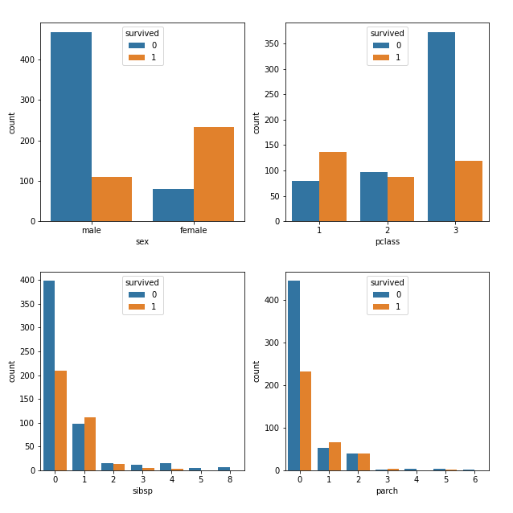

# Titanic ML model

this is the first ML model in which I use "scikit-learn" libriary.
the model uses three different algorithmes (Logistic regression, Decision tree, Random forest) to predict whether a person could've survived the Titanic disaster or not.
taking into account different features e.g (age, class , gender ...etc).
it then compares between the different algorithems choosing the most accurate one.

